## Setting up a Service Account in GCP

### Prerequisites

1. You need access to the GCP console.
   
### Objectives

The objective of this demonstration is to highlight how you can create a service account that will be used by Terraform to provision your infrastructure. 

### Directions

1. The first step requires you to use the GCP GUI Console.  Before we can use Terraform, we need to create a service account that will provide Terraform the permissions needed to create our infrastructure.  To do this:
   - Head over to the GCP console, in the search bar, enter `projects`.  You should then see the option to `Create a New Project`.  Choose this to create a new project, give your project a name, and then select the project.  I am using `CS-T680-Demos` for our project name.

   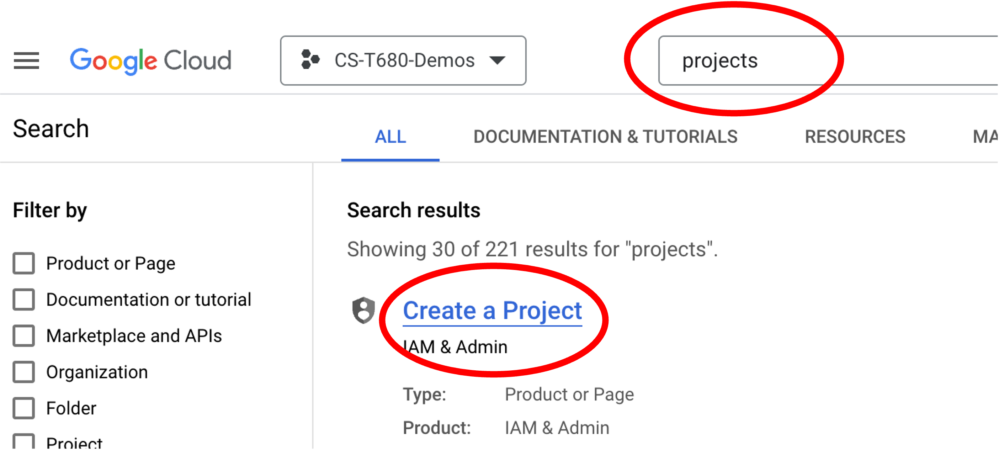
   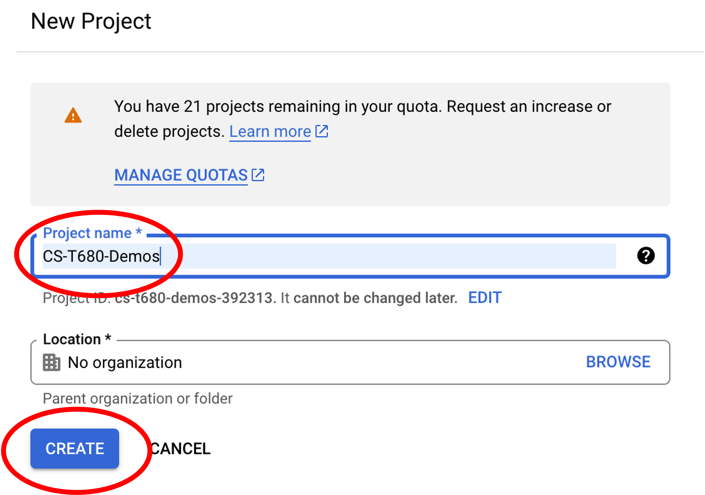
   

   - The next step will be creating a service account for Terraform.  Head over to the service account window by typing in "service accounts" in the search box until you see the "Service Accounts" option appear in the dropdown - select that option:
   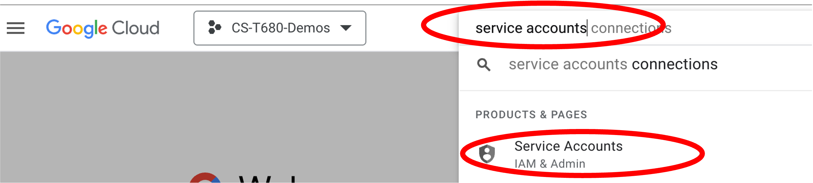

   - Now that you are on the service account page, create a new service account.  Use the `+CREATE SERVICE ACCOUNT` option on the top of the page

   - Fill out the form, give the service account a name - I will be using `terraform-service-account`.  The service account ID should auto populate. After that hit "CREATE AND CONTINUE", then hit "DONE"
   
   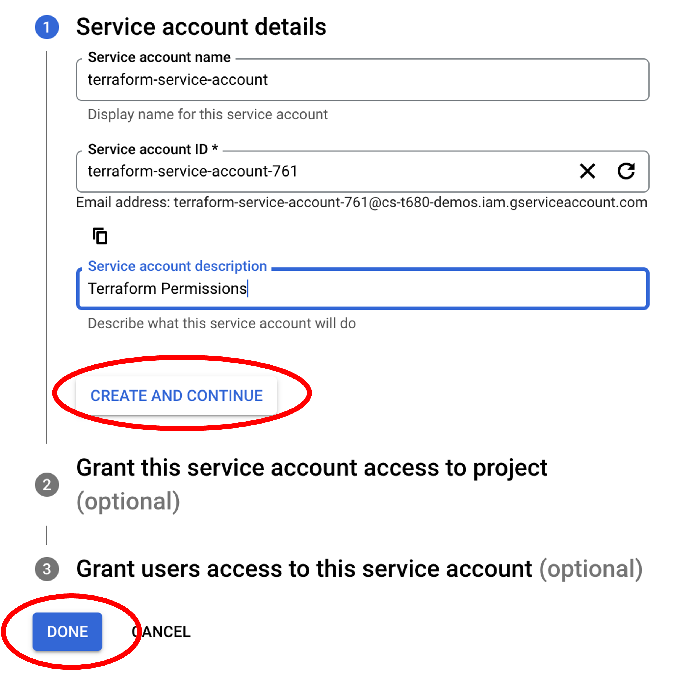

   - Now that you created your service account, we need to create a key file which we will use later.  The figures below show this process. Start by hitting the icon with the 3 vertical dots, then select "Manage Keys" from the popup. Once you get to the new window, hit "CREATE NEW KEY", Select "JSON" format, then hit "CREATE".  You will be prompted for a name of a file that will be generated and downloaded to your computer.  For this demo, I selected the file name as `service-account.json`.  Note, **YOU WILL NOT BE ABLE TO GENERATE THIS FILE AGAIN IF YOU MISPLACE IT, SO SAVE IT - YOU CAN ALWAYS GENERATE A NEW ONE**

    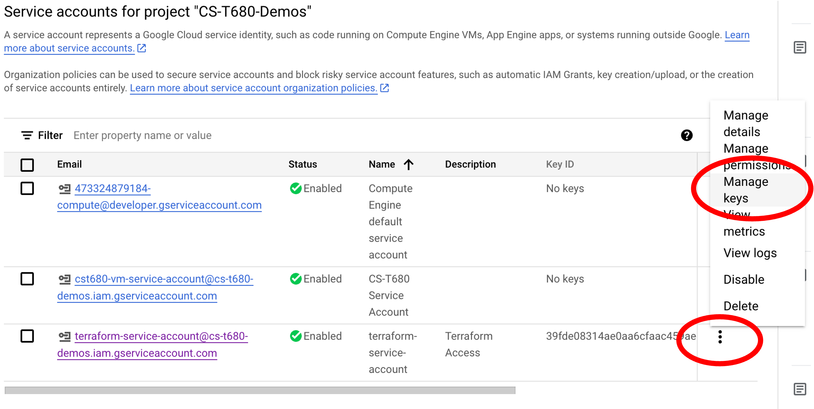
    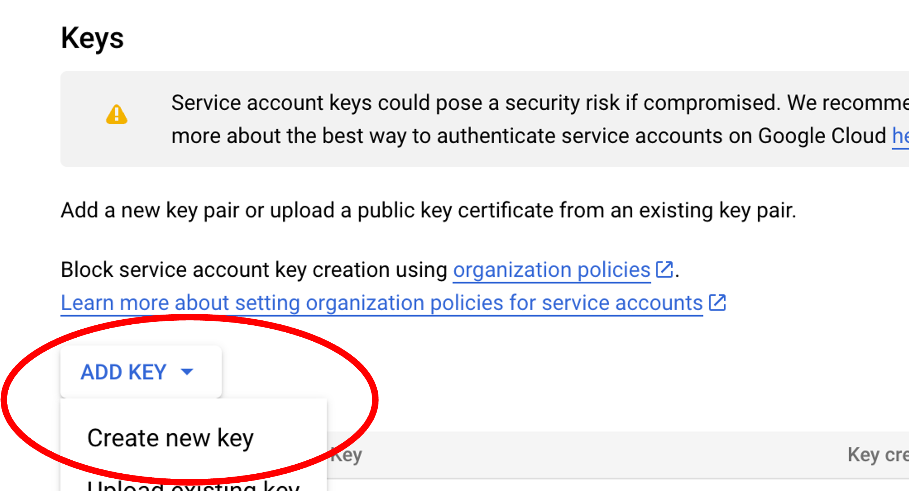
    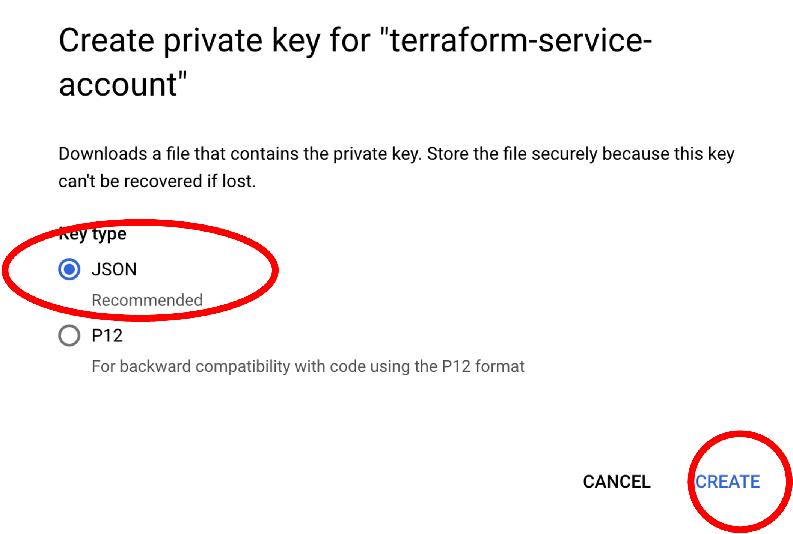

   - You should now see you newly created service account.  Next, lets configure it.  Go to the main IAM (Identity and Access Management) window, and then click the "pencil icon" next to your service account:
   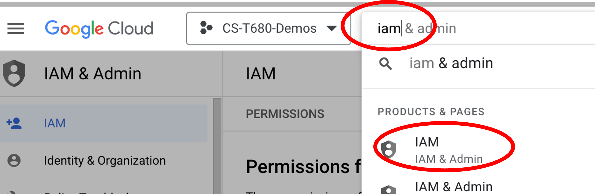
   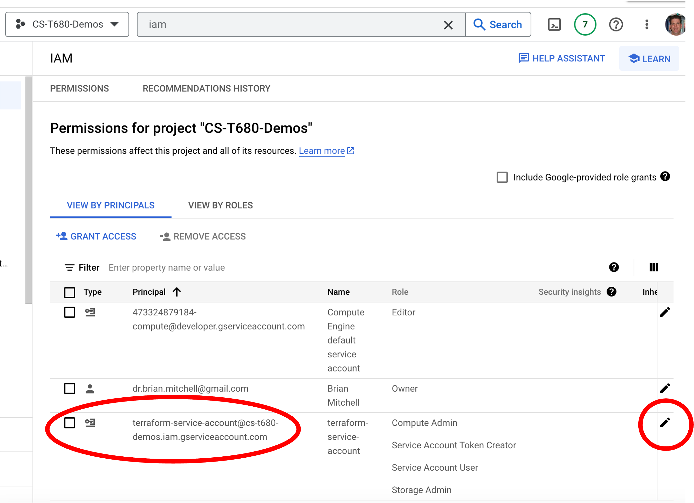

   _NOTE: Your view might look slightly different, as you will not have any roles yet_

   - Now, lets add the roles.  See the figures below, initially you will not have any roles.  Hit the `+ADD ANOTHER ROLE` button, and then using the search box, start typing the desired role that you need.  After that add that role.  Continue doing this until all of the roles shown in the picture are added.  You will need the following roles specifically - `Compute Admin`, `Service Account Token Creator`, `Service Account User`, and `Storage Admin`.  For now you dont need to know exactly what these do, but Terraform will need these permissions to build your infrastructure.  Once you have all of the roles shown, hit "SAVE"

   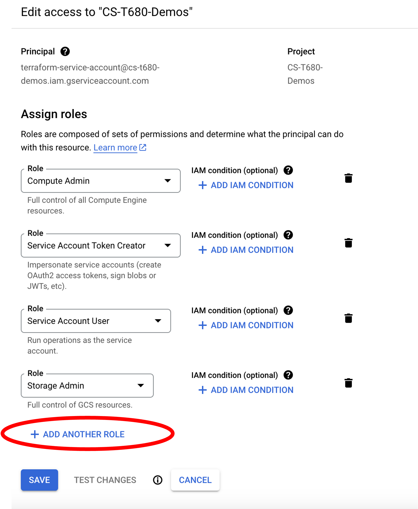
   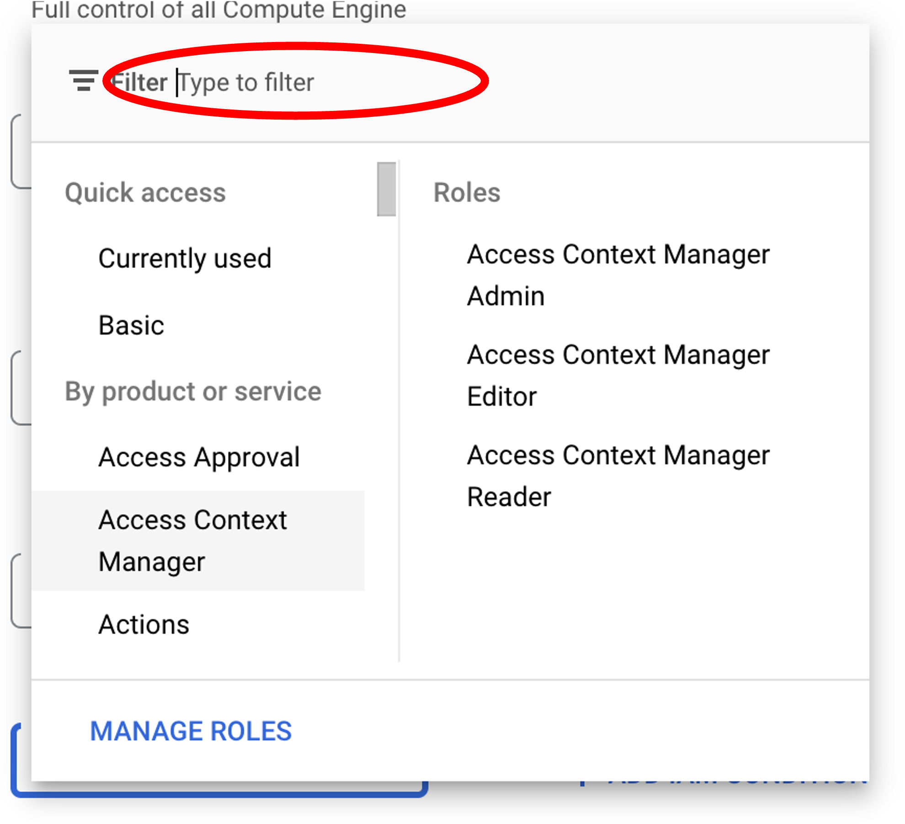
   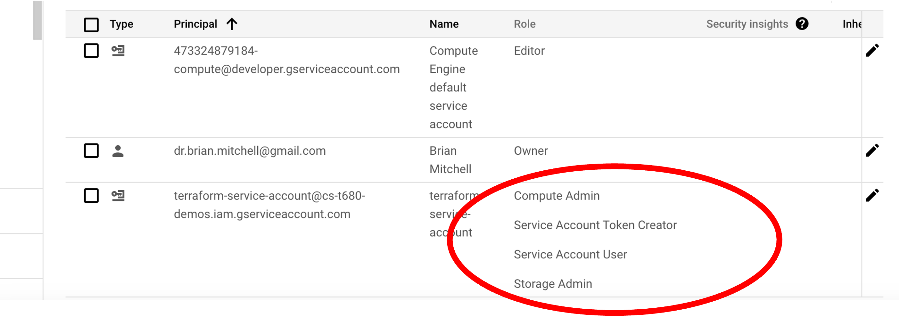

   **_One you get back to the main page, you should see the roles associated with your service account as shown in the picture above_**

### Verify

At this point you should be set if you have the JSON permission file downloaded, again I called mine `service-acct.json`, and your service account has the proper permissions/roles.  From above you need to have the following: `Compute Admin`, `Service Account Token Creator`, `Service Account User`, and `Storage Admin`. 

[BACK TO README](readme.md)